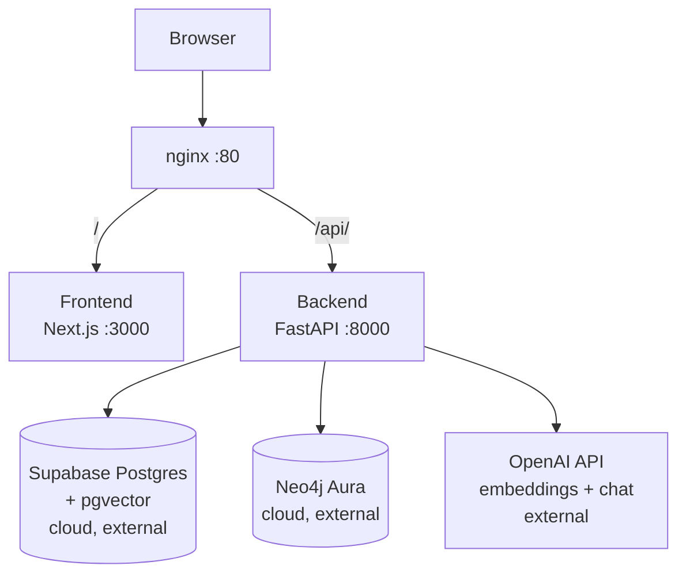

# Customer Support Knowledge Assistant

A Graph RAG (Retrieval-Augmented Generation) system for customer support, combining structured relational data, a knowledge graph, and semantic vector search to answer support questions with grounded, sourced answers.

## Architecture



**Design notes:**
- nginx is the single public entry point; `frontend` and `backend` are not directly reachable from outside the Docker network.
- Postgres (Supabase) and Neo4j (Aura) are fully managed cloud services — not containerized locally.
- The backend is the only component that talks to the databases and OpenAI; the frontend only ever calls the backend's API.

## Tech Stack

| Layer | Technology |
|---|---|
| Frontend | Next.js 16 (App Router), TypeScript, Tailwind CSS, React Flow |
| Backend | FastAPI, SQLAlchemy, Pydantic |
| Relational DB | PostgreSQL (Supabase), with `pgvector` for embeddings |
| Graph DB | Neo4j Aura |
| Embeddings & LLM | OpenAI `text-embedding-3-small`, `gpt-4o-mini` |
| Auth | Per-key API key authentication |
| Rate limiting | `slowapi` |
| Containerization | Docker, Docker Compose, nginx |

## Data Model

Six core entities and their relationships:

```
Customer -[RAISED]-> Ticket -[RELATED_TO]-> Product
Ticket -[HAS_ISSUE]-> Issue -[RESOLVED_BY]-> Solution
Product -[HAS_DOCUMENT]-> Document -> DocumentChunk (embedded)
```

Every entity is stored in Postgres (source of truth) and mirrored as nodes/relationships in Neo4j (for graph traversal), kept in sync automatically on every write.

## Features Implemented

- Full CRUD for Customers, Products, Tickets, Issues, Solutions, Documents
- Automatic Postgres to Neo4j sync on every write
- Document chunking + embedding pipeline (OpenAI `text-embedding-3-small`, stored via `pgvector`)
- Issue embedding for semantic matching against past resolved problems
- `POST /search` — semantic similarity search over document chunks
- `POST /ask` — Graph RAG: vector search (documents + issues) + Neo4j graph traversal (issue to solution) + LLM synthesis, with full source attribution
- `GET /graph/ticket/{id}` — returns a ticket's full connected graph (customer, product, issue, solution) for visualization
- API key authentication (per-key, revocable) on every endpoint
- Rate limiting on `/ask`, `/search`, `/documents`
- CORS configuration
- Request logging (console + persistent file)
- Full Next.js frontend: Dashboard, Records browser, Document upload, Search, Ask, and an interactive Graph Explorer (React Flow)
- Full Docker Compose setup: `backend`, `frontend`, `nginx` containers

## Project Structure

```
cska/
├── backend/
│   ├── main.py
│   ├── database.py          # Postgres/SQLAlchemy setup
│   ├── graph_database.py    # Neo4j connection setup
│   ├── graph_service.py     # Neo4j sync + query functions
│   ├── embedding_service.py # Chunking + OpenAI embeddings
│   ├── auth.py               # API key verification
│   ├── rate_limiter.py
│   ├── logging_config.py
│   ├── models.py             # SQLAlchemy models
│   ├── schemas.py            # Pydantic schemas
│   ├── routers/               # One router per entity + search/ask/graph/api_keys
│   └── Dockerfile
├── frontend/
│   ├── app/                   # Next.js App Router pages
│   ├── app/lib/api.ts         # Shared API client
│   └── Dockerfile
├── nginx/
│   ├── nginx.conf
│   └── Dockerfile
├── docker-compose.yml
└── .env.example
```

## Setup

### Prerequisites
- Python 3.14, Node.js 20+, Docker Desktop
- A Supabase project (Postgres with the `pgvector` extension enabled)
- A Neo4j Aura instance
- An OpenAI API key

### Local development (without Docker)

**Backend:**
```bash
cd backend
python -m venv venv
source venv/Scripts/activate   # Windows Git Bash
python -m pip install -r requirements.txt
cp ../.env.example ../.env     # then fill in real credentials
uvicorn main:app --reload
```

**Frontend:**
```bash
cd frontend
npm install
# create .env.local with NEXT_PUBLIC_API_URL and NEXT_PUBLIC_API_KEY
npm run dev
```

### With Docker

```bash
docker compose up --build
```

Then visit `http://localhost`.

## API Overview

All endpoints (except `POST /api-keys/`, used to bootstrap your first key) require an `X-API-Key` header.

| Endpoint | Description |
|---|---|
| `POST /customers/`, `/products/`, `/tickets/`, `/issues/`, `/solutions/`, `/documents/` | Create records |
| `GET` equivalents | List records |
| `PUT /tickets/{id}` | Update a ticket |
| `POST /search/` | Semantic search over document chunks |
| `POST /ask/` | Graph RAG question answering |
| `GET /graph/ticket/{id}` | Full connected graph for a ticket |
| `POST /api-keys/` | Generate a new API key |

Interactive API docs are available at `/docs` when running the backend directly (not through nginx).

## Roadmap

- [ ] CI/CD pipeline (GitHub Actions)
- [ ] AWS deployment
- [ ] Database schema diagram
- [ ] Neo4j graph model documentation
